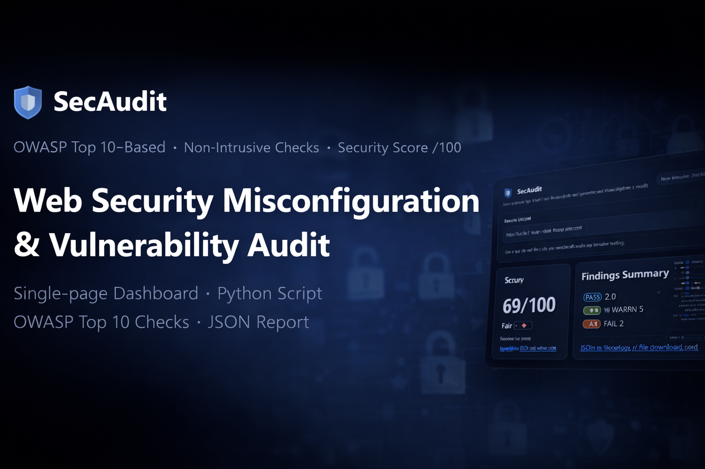
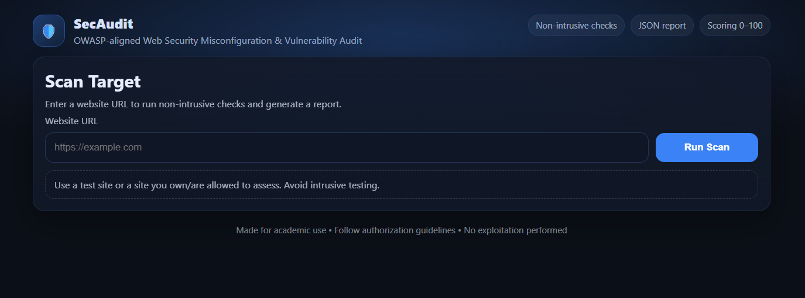

# SecAudit — Web Security Misconfiguration & Vulnerability Audit (OWASP Top 10–Based)

A **single-page dashboard + Python scanner** that performs **non-intrusive web security checks** aligned with **OWASP Top 10**.  
It analyzes common security misconfigurations, generates a **JSON report**, and provides a **security score out of 100** with clear deductions.

<p align="center">
  
</p>

---

## Description

**SecAudit** is built to help students and developers quickly assess a website’s **basic security posture** without performing exploitation.  
It focuses on real-world, high-impact configuration checks (headers, HTTPS enforcement, cookies, exposure risks) and produces a structured report for documentation and evaluation.

The tool includes:
- A **clean web dashboard** to enter a target URL and run the scan
- An automated **Python scanning engine**
- A **scoring system (0–100)** with transparent point deductions
- A downloadable **JSON report** stored locally

---

## Features

| Feature | Description |
|--------|-------------|
| **Interactive Dashboard** | Single-page UI to enter URL, run scan, view results |
| **Security Headers Audit** | Checks CSP, HSTS, X-Frame-Options, and more |
| **HTTPS Redirect + HSTS** | Verifies HTTP→HTTPS redirect and HSTS enforcement |
| **Cookie Flag Analysis** | Detects Secure / HttpOnly / SameSite flags |
| **Information Disclosure Checks** | Flags Server / X-Powered-By technology leakage |
| **Sensitive Path Accessibility** | Checks exposure of common sensitive paths (e.g., `.env`, `.git/`) |
| **HTTP Methods Enumeration** | Detects risky methods like PUT/DELETE/TRACE via OPTIONS |
| **Directory Listing Detection** | Checks for “Index of /” indicators on common folders |
| **Basic Reflected Input Check** | Looks for reflected marker in response (safe, non-exploit) |
| **JSON Report Generation** | Saves report to `/reports` and allows download |
| **Security Score (0–100)** | Score + rating + deduction reasons included |

---

## Tech Stack

- **Language:** Python 3.x  
- **Backend:** Flask  
- **Frontend:** HTML + CSS + JavaScript (single page)  
- **Libraries:** `requests`, `beautifulsoup4`, `tldextract`

---

## Dashboard Preview

<p align="center">
  
</p>

---

## Installation & Run

### 1) Clone the repository
```bash
git clone <your-repo-url>
cd secaudit
